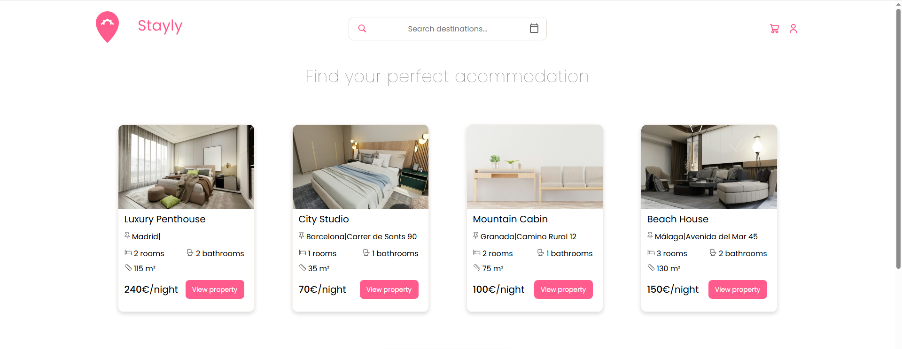
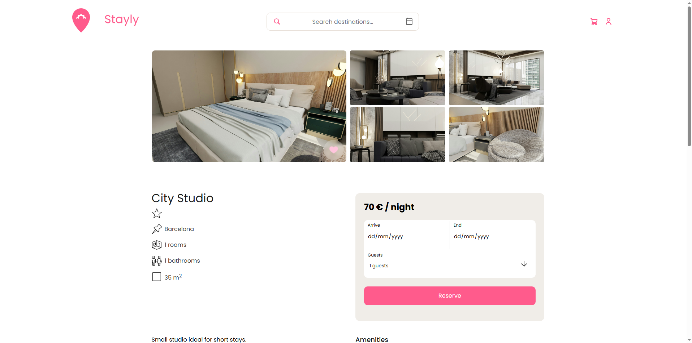

  
  
  
  
  

Modern booking platform inspired by Airbnb, built with PHP and MVC architecture.

Users can browse properties, manage wishlists, and complete booking workflows through a responsive interface.

## Tech Stack

- PHP
- MySQL
- HTML
- CSS
- JavaScript

## Features

- Authentication system with session handling
- Wishlist system with asynchronous AJAX requests
- Property booking workflow
- MVC architecture with separated controllers and models
- Dynamic property filtering
- Responsive UI inspired by Airbnb

## Screenshots

### Homepage

### Property page

- Responsive design improvements currently in progress
## Technical Decisions

- AJAX used for wishlist interactions to avoid full page reloads
- PDO used for secure database queries
- MVC architecture chosen for scalability and code organization

## Installation

1. Clone repository
2. Import database
3. Configure environment variables
4. Start Apache/MySQL
5. Run locally
